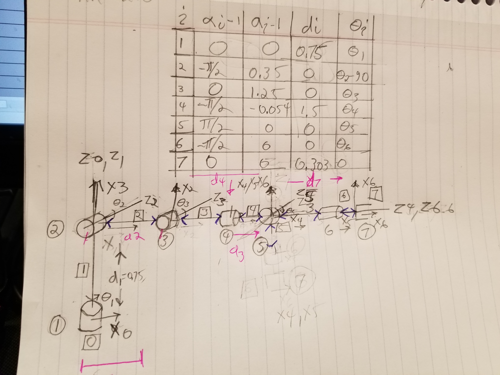
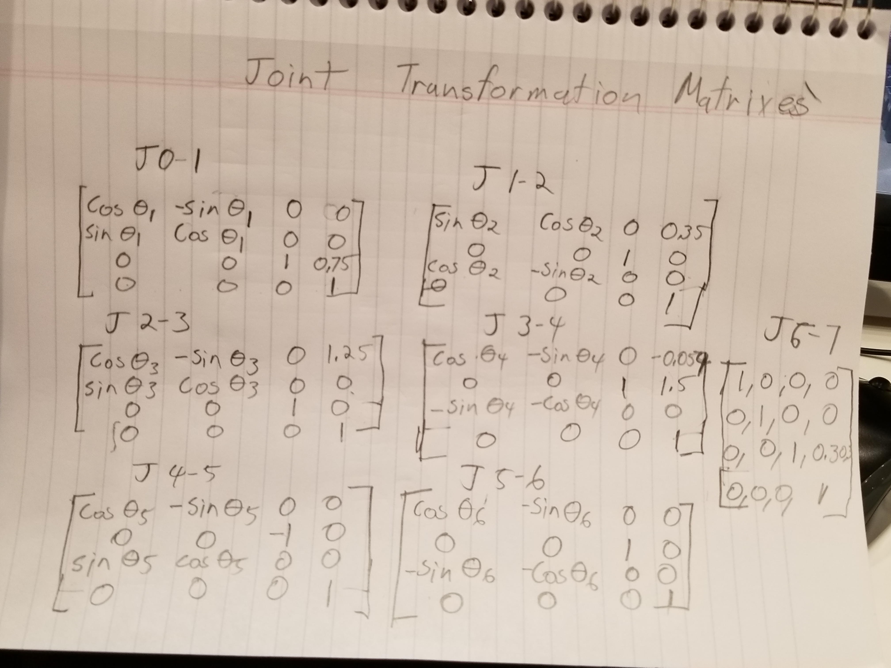

# Robot_arm_pick_and_place

This is the my submission repository for my Robot arm pick and place project.

---
title: "Kinematics Project - Pick & Place"
output: html_document
---

# Kinematic Analysis

***1. Run the forward_kinematics demo and evaluate the kr210.urdf.xacro file to perform
kinematic analysis of Kuka KR210 robot and derive its DH parameters.***

Using the forward Kinematics demo and the kr210.urdf.xacro file I was able derive the KR210s DH table as seen below.

***2. Using the DH parameter table you derived earlier, create individual transformation
matrices about each joint. In addition, also generate a generalized homogeneous
transform between base_link and gripper_link using only end-effector(gripper) pose.***

Using the techniques described in lesson 2 Section 10 and later I derived individual transform matrices for each join as seen in the following image. Table J 6-7 shows the generalised homogeneous
transform between base_link and gripper_link

***3. Decouple Inverse Kinematics problem into Inverse Position Kinematics and inverse
Orientation Kinematics; doing so derive the equations to calculate all individual joint
angles.***

This was easily the most difficult part of the assignment for me. I honestly had to get help from a physics professor friend of mine to derive these equations. That said, having spent a considerable amount of time on them my understanding of particular area is not as good as it should be. That said I will do my best to describe the inverse kinematic equations below. (I strongly recommend that udacity do a video going through the steps to derive these equations for the KR 210)

The inverse kinematics equations can be broken down into two groups. The equations for the circular wrist (joints 4, 5 and 6) and the equations for the rest of the arm (joints 1, 2 and 3). This is because the centre of the wrist essentially becomes the end effector for Joints 1, 2 and 3 and serves as the location to calculate the inverse transformation from. In completing this part of the project, I starter by deriving the equation for the wrist centre.

$$ WC = EExyzmatrix - 0.303 * R0-6 * [1][0][0] $$
From this I was able to derive joint 1 
$$J1 = arctan(WCy,WCx)$$
I actualy solved for 3 next as some aspects of 3 were needed for 2
$$J3 = pi/2 - arctan(squareroot(1 - (link2to5 -link3/-link2*(link2*link3-5 *2)^2))$$
Joint 2:
$$J2 = pi/2 - arctan((link3-5 * sin(arctan(1- (link2to5 -link3/-link2*(link2*link3-5 *2)^2)),(link2 * link 3-5*cos((link2to5 -link3/-link2*(link2*link3-5 *2)^2)))))) - arctan(J5z - J2z, sqrt(J5x-J2x)+J5y-J2y^2))$$

Next I moved on to the circular wrist joints

Joint 4:
J4 = R3-6 
rotated about the xaxis

Joint 5:

J5 = R3-6
rotated about the y axis

Joint 6:
J6 = R3-6 
rotated about the y axis

***1. Fill in the IK_server.py file with properly commented python code for calculating
Inverse Kinematics based on previously performed Kinematic Analysis. Your code must
guide the robot to successfully complete 8/10 pick and place cycles. Briefly discuss the
code you implemented and your results.***

Initially when I tried running this code my computer, it simply choked. Initially tried installing 
ubuntu 16.04 as a second OS on my computer and setting up ROS natively in order to improve performance. 
This sort of helped but the program still ran incredibly slowly. Finally I moved all of the Matrix initialisation 
code out of the for loop and this had a HUGE effect. The pre for loop code consists of initialising DH variables.
Creating individual joint transformation matrices. Building up a Joint 1 to gripper transformation matrix and then initialising basic x and y rotation matrixes.

The post For loop code consists of populating the end effector matrix with values from ROS and then preforming inverse 
transformation calculations that output a list angles necessary to place the arm end effector at the target location.
As mentioned before figuring out the calculations for the reverse transformation on this arm was extremely difficult and a video fully explaining this process is sorely needed.  

## Results

The arm often knocks over blocks on its way to target. As the the pathway calculations are correct, I can only conclude that the problem lies within the movement executions functions. As far as I can tell this problem lies outside the scope of this assignment. Beyond that the arm works quit well. 

### Areas of improvement

This method of moving the arm seems excessively computer intensive. Were I to build this program from scratch I would 
simply give the arm a library of moves that would allow it to accomplish it's goals. Were I to go so far as to give it approximately 9 squared moves I could even eliminate the need for it to return to the centre every time (which would increase speed). Were I to give it the ability to make small random changes to its joint orientation, save those changes it the result is better than the pre-programmed results and then configure itself into the proper orientation if the random changes make the situation worse. I could enable it to become a self learning arm. 
